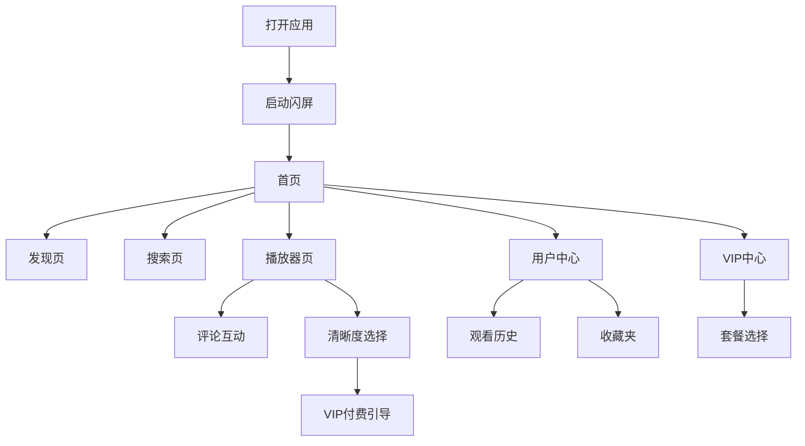

## 1. 产品概述

StreamFlow 是一款面向移动端优先的影视流媒体商业化应用，提供沉浸式观影体验与会员增值服务。产品以清新明亮的白色主题为核心，通过优雅的卡片布局、流畅的交互动画和精准的商业化触点，打造高品质的视频娱乐平台。

## 2. 核心功能

### 2.1 用户角色
| 角色 | 注册方式 | 核心权限 |
|------|----------|----------|
| 游客 | 无需注册 | 浏览首页、观看免费内容（480P/720P） |
| 普通会员 | 手机号注册 | 观看1080P、收藏、评论、下载 |
| VIP会员 | 付费订阅 | 4K画质、免广告、抢先观看、专属内容 |

### 2.2 功能模块
1. **启动闪屏**：品牌 Logo 展示与加载动画，2秒后自动进入首页
2. **首页**：顶部导航栏、Hero 轮播推荐、热门推荐、继续观看、分类浏览、底部 Tab 导航
3. **发现页**：影片网格展示、多维筛选（类型/年份/地区）、下拉加载更多
4. **搜索页**：实时搜索建议、搜索历史、结果网格展示
5. **播放器页**：视频播放控制、清晰度切换、倍速播放、选集、VIP 付费引导
6. **用户中心**：个人信息、观看历史、收藏夹、下载管理、设置
7. **VIP中心**：会员权益对比、套餐选择、立即开通
8. **互动功能**：评论展示、点赞收藏、Toast 状态反馈
9. **商业化**：信息流广告位、VIP 标识、权限限制弹窗

### 2.3 页面详情
| 页面名称 | 模块名称 | 功能描述 |
|----------|----------|----------|
| 启动页 | 闪屏 | Logo 淡入 + 加载进度条，2秒后跳转 |
| 首页 | 导航栏 | Logo、搜索入口、VIP入口、用户头像 |
| 首页 | Hero轮播 | 3张自动轮播大图，含标题/简介/播放按钮/VIP标签 |
| 首页 | 热门推荐 | 横向滚动卡片，展示6部热门影片 |
| 首页 | 继续观看 | 横向滚动，展示观看进度条 |
| 首页 | 分类浏览 | 动作/喜剧/悬疑/动漫横向滚动 |
| 发现页 | 筛选栏 | 类型/年份/地区下拉筛选 |
| 发现页 | 影片网格 | 瀑布流布局，下拉加载更多 |
| 搜索页 | 搜索框 | 实时建议+历史标签+清除功能 |
| 搜索页 | 结果展示 | 网格布局，支持空状态 |
| 播放器页 | 视频区 | 模拟播放界面+控制栏 |
| 播放器页 | 清晰度 | 480P/720P/1080P/4K(VIP) |
| 播放器页 | 互动区 | 评论区+点赞收藏+Toast反馈 |
| 用户中心 | 信息卡 | 头像/昵称/VIP到期时间 |
| 用户中心 | 功能列表 | 观看历史/收藏夹/下载/设置 |
| VIP中心 | 权益对比 | 月度/季度/年度套餐卡片 |
| VIP中心 | 支付引导 | 高亮推荐+立即开通按钮 |

## 3. 核心流程

用户打开应用 → 启动闪屏（2秒）→ 进入首页 → 浏览推荐内容 → 点击影片 → 进入播放器 → 选择清晰度（VIP内容提示付费）→ 观看/互动/收藏 → 返回首页或进入个人中心

## 4. 用户界面设计

### 4.1 设计风格
- **主题**：清新明亮白色主题，拒绝夜间模式与深色元素
- **主色调**：纯白背景 `#FFFFFF`，浅灰背景 `#F8F9FA`
- **强调色**：珊瑚橙 `#FF6B4A` 用于主按钮和 VIP 标识，薄荷绿 `#4ECDC4` 用于次要操作
- **文字色**：深炭灰 `#1A1A2E` 主标题，中灰 `#6B7280` 正文，浅灰 `#9CA3AF` 辅助文字
- **按钮**：圆角 12px，主按钮珊瑚橙渐变，次按钮白色描边
- **字体**：Display 字体使用 `Playfair Display`（优雅衬线），正文使用 `Plus Jakarta Sans`（现代无衬线）
- **布局**：移动端优先，卡片式布局，圆角 16px，阴影 `0 4px 20px rgba(0,0,0,0.08)`
- **图标**：Lucide React 图标库，线条风格，2px 描边

### 4.2 页面设计概览
| 页面名称 | 模块名称 | UI元素 |
|----------|----------|--------|
| 启动页 | 全屏 | 居中Logo、环形加载动画、渐变背景 |
| 首页 | 导航栏 | 固定顶部、毛玻璃效果、高度56px |
| 首页 | Hero轮播 | 全宽、高度280px、圆角16px、自动轮播3秒 |
| 首页 | 横向滚动 | 隐藏滚动条、卡片宽度140px、间距12px |
| 发现页 | 筛选栏 | 横向滚动标签、选中状态珊瑚橙底 |
| 发现页 | 网格 | 2列瀑布流、间距12px、图片圆角12px |
| 搜索页 | 搜索框 | 圆角24px、灰色背景、搜索图标 |
| 播放器页 | 控制栏 | 底部固定、黑色半透明背景、白色图标 |
| VIP中心 | 套餐卡 | 垂直排列、中间卡片高亮放大、金色边框 |
| 用户中心 | 信息卡 | 顶部渐变背景、圆形头像、居中布局 |

### 4.3 响应式设计
- 移动端优先（375px - 428px 为基准设计）
- 平板端（768px+）横向滚动改为网格展示
- 桌面端（1024px+）限制最大宽度 430px 居中显示，模拟手机体验

### 4.4 动画设计
- **页面切换**：淡入淡出 300ms，ease-in-out
- **卡片悬停**：缩放 1.02，阴影加深，200ms
- **轮播切换**：滑动过渡 500ms，cubic-bezier(0.4, 0, 0.2, 1)
- **按钮点击**：缩放 0.96，100ms
- **Toast提示**：从底部滑入 300ms，停留2秒后滑出
- **加载状态**：骨架屏脉冲动画
- **下拉刷新**：旋转加载图标

## 5. 商业化设计

### 5.1 广告位
- 首页信息流第4位插入模拟广告卡片
- 广告卡片带"广告"角标，浅蓝色背景区分
- 点击广告弹出提示"广告功能演示"

### 5.2 VIP标识
- VIP内容卡片右上角金色皇冠图标
- 播放器清晰度选项4K带"VIP"标签
- 用户头像旁VIP状态金色边框

### 5.3 权限限制
- 非VIP选择4K时弹出付费引导弹窗
- 未登录用户点击收藏时弹出登录提示
- 限制操作后提供明确的升级/登录路径
