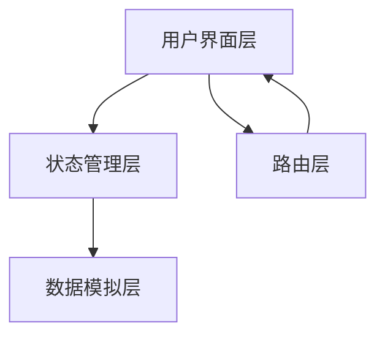

## 1. 架构设计



## 2. 技术描述

- **前端框架**: React 18 + TypeScript
- **构建工具**: Vite
- **样式方案**: Tailwind CSS 3
- **状态管理**: Zustand
- **路由**: React Router DOM
- **图标库**: Lucide React
- **字体**: Google Fonts (Playfair Display + Plus Jakarta Sans)
- **数据**: 全模拟数据，无后端依赖

## 3. 路由定义

| 路由 | 用途 |
|------|------|
| /splash | 启动闪屏页 |
| /home | 首页（默认） |
| /discover | 发现页 |
| /search | 搜索页 |
| /player/:id | 播放器页 |
| /profile | 用户中心 |
| /vip | VIP会员中心 |

## 4. 数据模型

### 4.1 影片数据
```typescript
interface Movie {
  id: string;
  title: string;
  description: string;
  cover: string;
  poster: string;
  genre: string[];
  year: number;
  region: string;
  rating: number;
  isVip: boolean;
  duration: string;
  episodes?: number;
  progress?: number; // 观看进度 0-100
}
```

### 4.2 用户数据
```typescript
interface User {
  id: string;
  nickname: string;
  avatar: string;
  isVip: boolean;
  vipExpireDate?: string;
  watchHistory: Movie[];
  favorites: Movie[];
  downloads: Movie[];
}
```

### 4.3 评论数据
```typescript
interface Comment {
  id: string;
  userId: string;
  nickname: string;
  avatar: string;
  rating: number;
  content: string;
  likes: number;
  isLiked: boolean;
  createdAt: string;
}
```

## 5. 状态管理设计

### 5.1 全局状态 (Zustand)
```typescript
interface AppState {
  // 用户状态
  user: User | null;
  isLoggedIn: boolean;
  
  // 应用状态
  currentRoute: string;
  isPlaying: boolean;
  currentMovie: Movie | null;
  
  // 播放状态
  playbackQuality: '480P' | '720P' | '1080P' | '4K';
  playbackSpeed: number;
  currentTime: number;
  duration: number;
  
  // 交互状态
  toast: { message: string; type: 'success' | 'error' | 'info' } | null;
  showVipModal: boolean;
  showLoginModal: boolean;
  
  // Actions
  setUser: (user: User | null) => void;
  login: () => void;
  logout: () => void;
  showToast: (message: string, type?: string) => void;
  hideToast: () => void;
  setShowVipModal: (show: boolean) => void;
  setShowLoginModal: (show: boolean) => void;
}
```

## 6. 组件结构

```
src/
├── components/
│   ├── SplashScreen.tsx      # 启动闪屏
│   ├── BottomNav.tsx         # 底部导航栏
│   ├── TopNav.tsx            # 顶部导航栏
│   ├── HeroCarousel.tsx      # Hero轮播
│   ├── MovieCard.tsx         # 影片卡片
│   ├── HorizontalScroll.tsx  # 横向滚动容器
│   ├── Toast.tsx             # Toast提示
│   ├── VipModal.tsx          # VIP付费弹窗
│   ├── LoginModal.tsx        # 登录弹窗
│   ├── AdCard.tsx            # 广告卡片
│   ├── CommentSection.tsx    # 评论区
│   └── FilterBar.tsx         # 筛选栏
├── pages/
│   ├── Home.tsx              # 首页
│   ├── Discover.tsx          # 发现页
│   ├── Search.tsx            # 搜索页
│   ├── Player.tsx            # 播放器页
│   ├── Profile.tsx           # 用户中心
│   └── VipCenter.tsx         # VIP中心
├── store/
│   └── useStore.ts           # Zustand状态管理
├── data/
│   └── mockData.ts           # 模拟数据
├── types/
│   └── index.ts              # TypeScript类型定义
├── App.tsx                   # 根组件
└── main.tsx                  # 入口文件
```

## 7. 构建配置

- **输出目录**: `dist`
- **基础路径**: `./` (相对路径，支持静态部署)
- **代码分割**: 禁用（单页应用，所有路由组件直接导入）
- **CSS**: Tailwind CSS + 自定义字体导入
